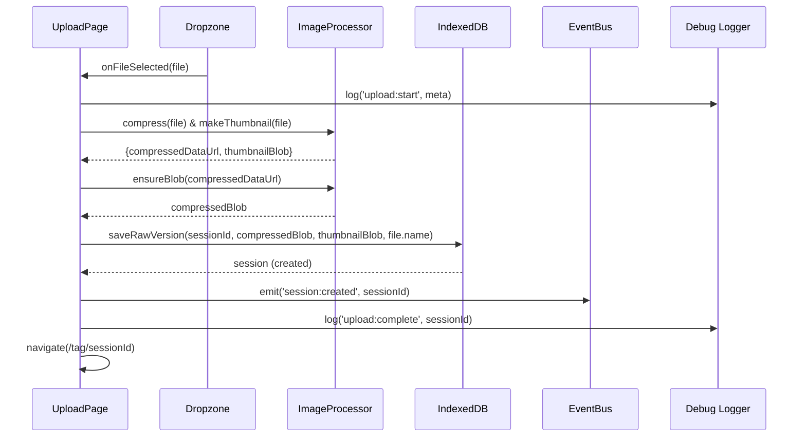
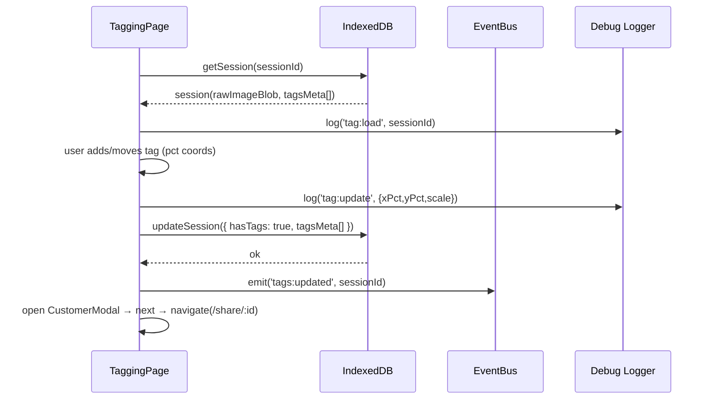
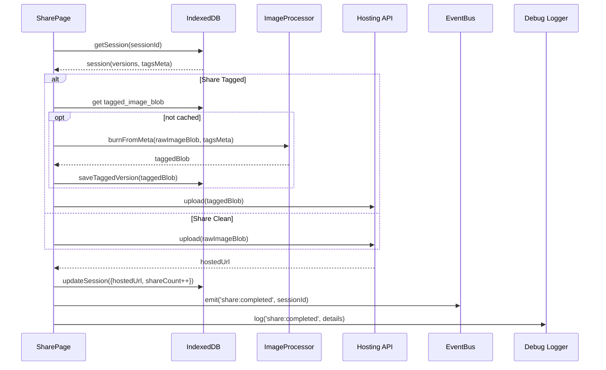
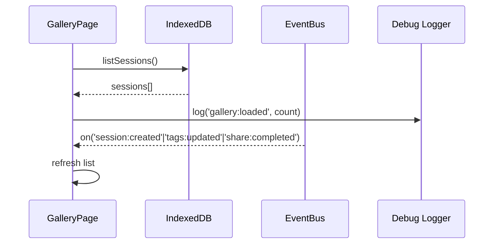
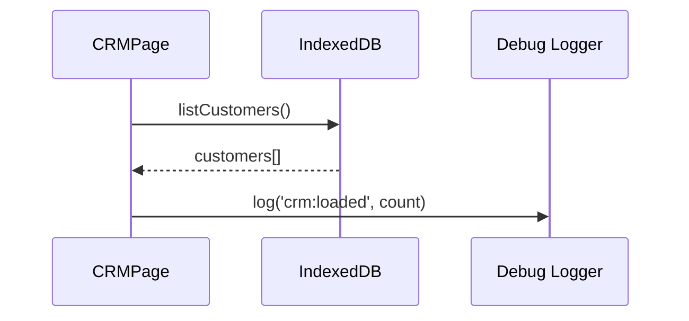
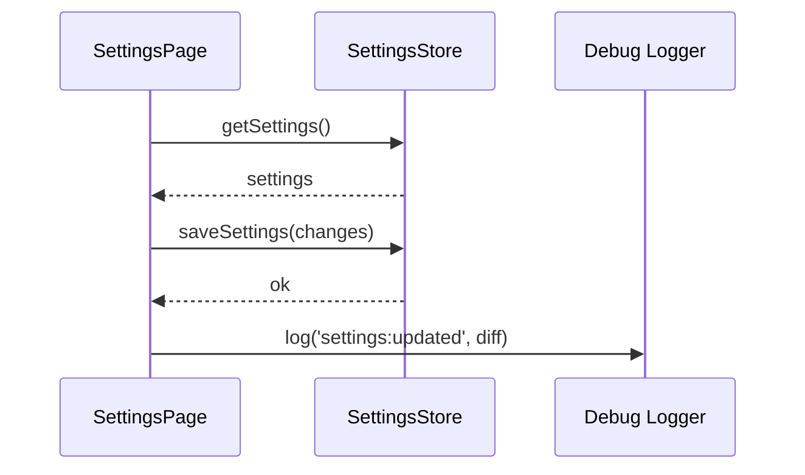
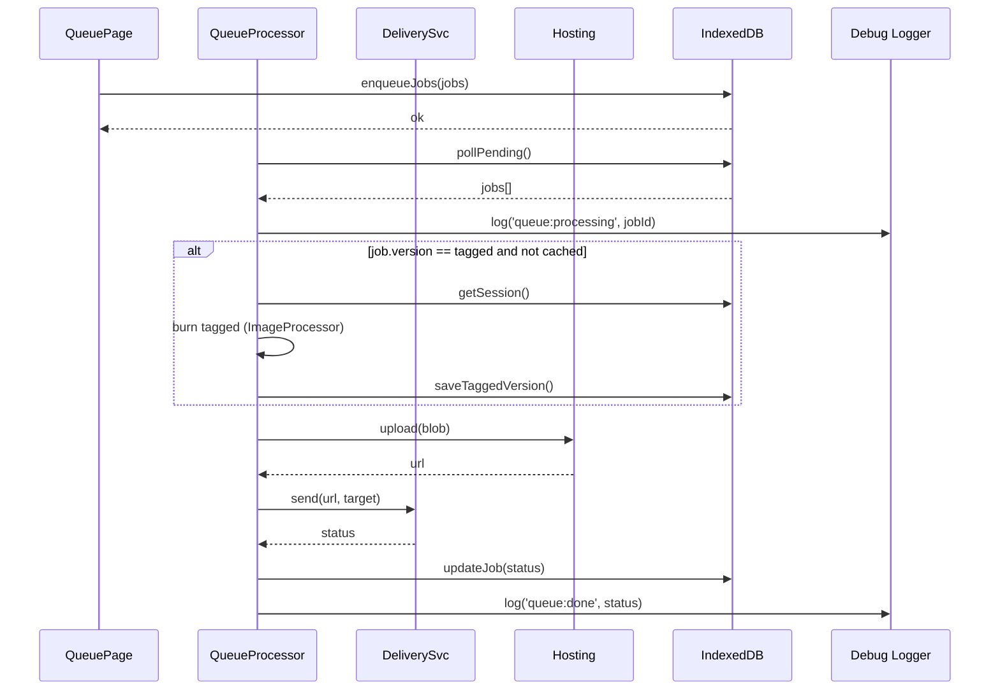
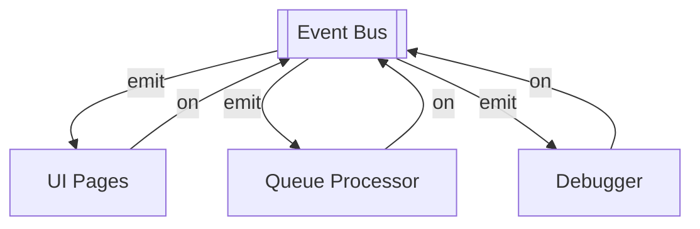
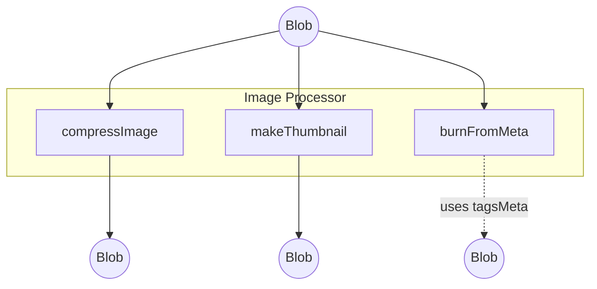
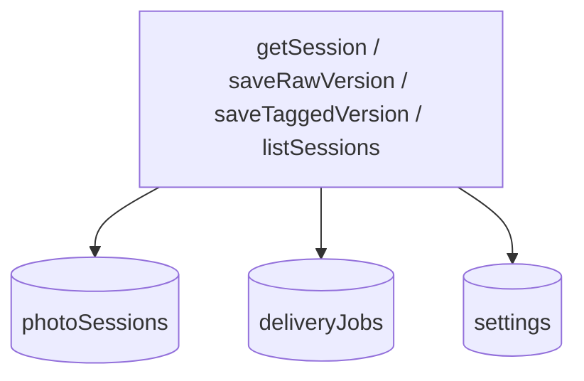

# PMC Social Tagger — Architecture & Data Flow

This document provides **component architecture diagrams** and **data flow charts** for every page in the app, plus shared services and the in-app debugger instrumentation.

> Legend: **[C]** = Component, **[S]** = Service/Store, **[R]** = Route/Page, **[D]** = Debug Hook.

---

## Global Architecture Overview

```mermaid
flowchart LR
  subgraph UI[UI Routes]
    UploadR([/upload \n Upload Page [R]])
    TagR([/tag/:id \n Tagging Page [R]])
    ShareR([/share/:id \n Share Page [R]])
    GalleryR([/gallery \n Gallery/Database Page [R]])
    CRMR([/crm \n CRM Page [R]])
    SettingsR([/settings \n Settings Page [R]])
    QueueR([/queue \n Delivery Queue Page [R]])
    MonitorR([/deliveries \n Delivery Monitor Page [R]])
    DebugR([/debug \n System Debug Console [R]])
  end

  subgraph Core[Core Services / Stores]
    DB[(IndexedDB/Dexie [S])]
    ImgProc[[Image Processor (Canvas/WebWorker) [S]]]
    Storage[[Image Hosting API [S]]]
    Delivery[[Delivery Services (Email/SMS) [S]]]
    Queue[[Delivery Queue Processor [S]]]
    Bus[[Event Bus (AppEvents) [S]]]
    SettingsS[[Settings Store [S]]]
    DebugS[[Debug Logger & Timeline [S] [D]]]
  end

  UploadR --> DB
  UploadR --> ImgProc
  TagR --> DB
  TagR --> ImgProc
  ShareR --> DB
  ShareR --> ImgProc
  ShareR --> Storage
  GalleryR --> DB
  CRMR --> DB
  SettingsR --> SettingsS
  QueueR --> Queue
  Queue --> Delivery
  Delivery --> Storage
  MonitorR --> Queue

  %% Debug hooks
  UploadR -. logs .-> DebugS
  TagR -. logs .-> DebugS
  ShareR -. logs .-> DebugS
  GalleryR -. logs .-> DebugS
  CRMR -. logs .-> DebugS
  SettingsR -. logs .-> DebugS
  QueueR -. logs .-> DebugS
  MonitorR -. logs .-> DebugS
  Core -. metrics .-> DebugS
  DebugR <--> DebugS
```

---

## Data Models (Shared)

- **PhotoSession**: `{ sessionId, imageName, rawImageBlob, rawThumbBlob, taggedImageBlob?, taggedThumbBlob?, hasTags, tagsMeta[], currentVersion: 'raw'|'tagged', createdAt, lastSharedAt?, shareCount, hostedUrl?, deliveryPreference? }`
- **TagMeta**: `{ type: 'instagram'|'custom', xPct, yPct, logoScale, text, fontSize, color, shadow, createdAt }`
- **Settings**: `{ brandName, igHandle, eventName, watermarkStyle, deliveryProviders, sizeLimits }`
- **DeliveryJob**: `{ jobId, sessionId, target: {email?, phone?}, version: 'raw'|'tagged', status: 'pending'|'processing'|'done'|'failed', attempts, createdAt, updatedAt }`

---

# Pages — Component Architecture & Data Flow

## 1) Upload Page (/upload)

### Component Architecture

```mermaid
flowchart TD
  UploadR[UploadPage [R]] --> Uploader[ImageUploader [C]]
  UploadR --> Preview[PreviewCard [C]]
  UploadR --> Actions[UploadActions [C]]
  UploadR --> UDbg[[DebugHook('upload:*') [D]]]

  Uploader --> Dropzone[DropzoneArea [C]]
  Uploader --> Rules[UploadRules [C]]
```

### Data Flow (Happy Path)



---

## 2) Tagging Page (/tag/\:sessionId)

### Component Architecture

```mermaid
flowchart TD
  TagR[TaggingPage [R]] --> ImgStage[ImageStage [C]]
  TagR --> TagOverlay[SocialTagger [C]]
  TagR --> TagForm[TagInputPanel [C]]
  TagR --> CustModal[CustomerModal [C]]
  TagR --> TDbg[[DebugHook('tagging:*') [D]]]

  TagOverlay --> InstaTag[InstagramTag [C]]
```

### Data Flow (Non-Destructive Tag Save)



---

## 3) Share Page (/share/\:sessionId)

### Component Architecture

```mermaid
flowchart TD
  ShareR[SharePage [R]] --> Prev[SharePreview [C]]
  ShareR --> Btns[ShareActions [C]]
  ShareR --> Cap[CaptionBlock [C]]
  ShareR --> SDbg[[DebugHook('share:*') [D]]]
```

### Data Flow (Version-Aware Sharing)



---

## 4) Gallery / Database Page (/gallery)

### Component Architecture

```mermaid
flowchart TD
  GalleryR[GalleryPage [R]] --> Filters[FilterBar [C]]
  GalleryR --> Grid[SessionGrid [C]]
  GalleryR --> Card[SessionCard [C]]
  GalleryR --> GDbg[[DebugHook('gallery:*') [D]]]
```

### Data Flow



---

## 5) CRM Page (/crm)

### Component Architecture

```mermaid
flowchart TD
  CRMR[CRMPage [R]] --> Table[CustomerTable [C]]
  CRMR --> Detail[CustomerDetail [C]]
  CRMR --> CDbg[[DebugHook('crm:*') [D]]]
```

### Data Flow



---

## 6) Settings Page (/settings)

### Component Architecture

```mermaid
flowchart TD
  SettingsR[SettingsPage [R]] --> Forms[SettingsForm [C]]
  SettingsR --> Preview[WatermarkPreview [C]]
  SettingsR --> SDdbg[[DebugHook('settings:*') [D]]]
```

### Data Flow



---

## 7) Delivery Queue (/queue) & Monitor (/deliveries)

### Component Architecture

```mermaid
flowchart TD
  QueueR[QueuePage [R]] --> NewJob[NewJobForm [C]]
  QueueR --> JobList[JobList [C]]
  QueueR --> QDbg[[DebugHook('queue:*') [D]]]

  MonitorR[DeliveryMonitor [R]] --> Board[StatusBoard [C]]
  MonitorR --> Log[DeliveryLog [C]]
  MonitorR --> MDbg[[DebugHook('deliveries:*') [D]]]
```

### Data Flow



---

# Debugger — Global Hooks & Events

- **DebugHook(namespace)**: lightweight component that registers with **Debug Logger & Timeline**.
- **Log Levels**: `trace`, `info`, `warn`, `error`.
- **Namespaces**: `upload:*`, `tagging:*`, `share:*`, `gallery:*`, `crm:*`, `settings:*`, `queue:*`, `deliveries:*`, `db:*`, `image:*`.
- **Recorded Fields**: `timestamp`, `namespace`, `action`, `payload`, `sessionId?`, `jobId?`, `duration?`, `result?`.
- **UI (System Debug Console)**:
  - Filters by namespace, level, time window
  - Live event stream with pause/resume
  - Detail panel shows payload JSON and related IDs
  - Export timeline to JSON

---

## Shared Services — Component Diagrams

### Event Bus (AppEvents)



### Image Processor



### IndexedDB (Dexie) Access



---

## Notes

- All diagrams use non-destructive tagging: **raw** preserved, **tagged** generated on-demand and cached.
- Every page includes a **DebugHook** with a clear namespace for tracing.
- Function names and routes mirror the spec so non-engineers can map UI → behavior.

